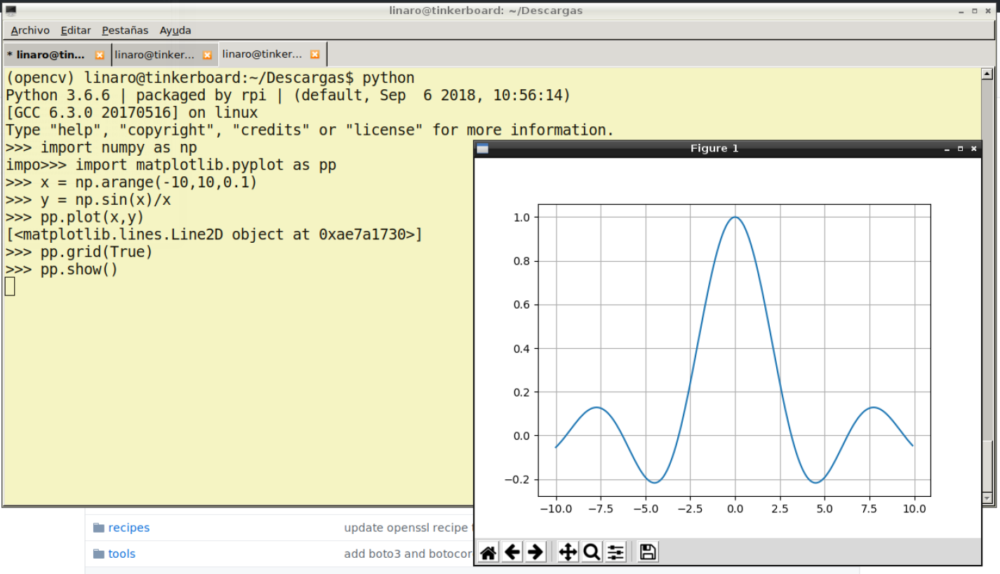

## Berry Conda

Berryconda is a Conda based Python distribution for the Raspberry Pi and TinkerOS (Tinker Board - ASUS).  With it,
you can install and manage a scientific or Pydata stack on your Raspberry Pi and Tinker Board using
[conda](http://conda.pydata.org/docs/), a package and environment management system.
All this can be done without compiling a single package!

## Quick start

Berryconda is designed to work with [raspbian](https://www.raspbian.org/)
jessie and [TinkerOS Debian](https://tinkerboarding.co.uk/wiki/index.php/TinkerOS).  Other Linux versions and distributions may or may not work.
When using non-raspbian based distributions, bzip2 should be installed.

To install Berryconda, download the installer appropiate for your Raspberry Pi
model or Tinker Board.  For Raspberry Pi 2 or 3 and Tinker Board use the armv7l installers.  For Raspberry
Pi 1 or Zero use the armv6l installer.

Berryconda comes in two 'flavors', Berryconda2 and Berryconda3.  The difference
between these are the version of Python installed; Berryconda2 installs
Python 2.7, and Berryconda3 installs Python 3.6. Choose the version you want installed.

### armv7l installers (Raspberry Pi 2 or 3 or Tinker Board)

* [Berryconda3-2.0.0-Linux-armv7l.sh](https://github.com/jjhelmus/berryconda/releases/download/v2.0.0/Berryconda3-2.0.0-Linux-armv7l.sh)
* [Berryconda2-2.0.0-Linux-armv7l.sh](https://github.com/jjhelmus/berryconda/releases/download/v2.0.0/Berryconda2-2.0.0-Linux-armv7l.sh)


### armv6l installers (Raspberry Pi 1 or Zero)

* [Berryconda3-2.0.0-Linux-armv6l.sh](https://github.com/jjhelmus/berryconda/releases/download/v2.0.0/Berryconda3-2.0.0-Linux-armv6l.sh)
* [Berryconda2-2.0.0-Linux-armv6l.sh](https://github.com/jjhelmus/berryconda/releases/download/v2.0.0/Berryconda2-2.0.0-Linux-armv6l.sh)

Once this file is downloaded on your Raspberry Pi or Tinker Board, make the file executable
using `chmod` and the execuate the installer.  For example, to install
Berryconda3 on a Raspberry Pi 3:

```
chmod +x Berryconda3-2.0.0-Linux-armv7l.sh
./Berryconda3-2.0.0-Linux-armv7l.sh
```

Follow the prompts to finish your install of Berryconda.

Berryconda should be installed in a user account, not by root or using sudo.

Once installed use the [conda](http://conda.pydata.org/docs/) command to
add packages from the [rpi](https://anaconda.org/rpi/) channel.


### Installing Berryconda on Tinker Board
The process that must be followed to install Berryconda in the Tinker Board is the same. You only need to execute the following command:

```
./Berryconda3-2.0.0-Linux-armv7l.sh
```

After that, you can create a repository (for example "opencv") using the following command (Figure 1):

```
conda create --name opencv python=3.6 numpy matplotlib
```
This will create a repository named "opencv" with Python 3.6 version and  [numpy](https://numpy.org/) and [matplotlib](https://matplotlib.org/) libraries.


*Figure 1. A screenshot of the virtual environment creation process*

Once you have created the virtual environment, you can activate it using the following command:

```
source activate opencv
```
After that you will able to use Python and import the packages. The Figure 2 depicts an example where I used the MatplotLib libraty:


*Figure 2. Using the MatplotLib and Numpy in the virtual environment*

## Details

Berryconda is created using [constructor](https://github.com/conda/constructor)
using the configuration files in the **installer** directory of this
repository.

The packages in the [rpi](https://anaconda.org/rpi/) channel were created
using [conda-build](https://conda.io/projects/conda-build/en/latest/concepts/recipe.html)
using the recipes in the **recipes** directory of this repository.

Package building is done on two Raspberry Pi 3s, a Raspberry Pi 1, and a
Raspberry Pi Zero.

## Issues and package requests

Please report any problems with Berryconda or the packages in the rpi channel
by submitting an [issue](https://github.com/jjhelmus/berryconda/issues).
Also, use this link to request new packages.

## Acknowlegements

The majority of the packages used in Berryconda were adapted from
[conda-forge](http://conda-forge.github.io/) recipes. A big thanks to
everyone involved in the project!

Thanks to [Continuum Analytics](https://www.continuum.io/) for hosting the rpi
channel on the [Anaconda Cloud](https://anaconda.org) and for creating the
conda ecosystem.
